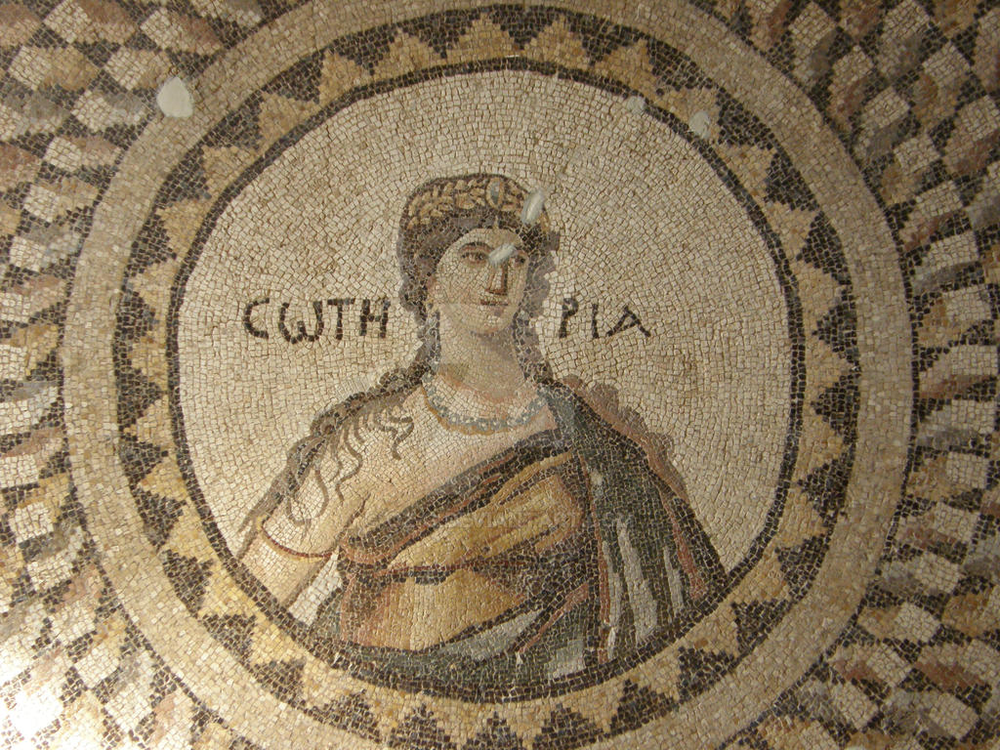
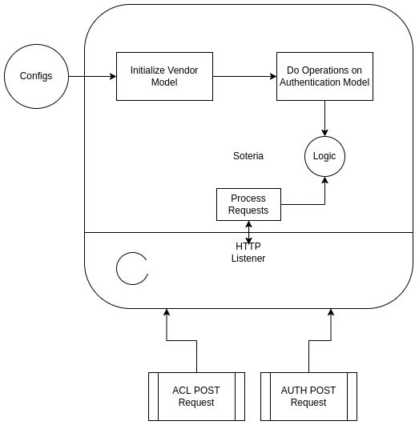

<h1 align="center"> Soteria </h1>

<p align="center">
    
</p>

<p align="center">
    
    
    
</p>

## Introduction

Soteria is responsible for Authentication and Authorization of every request sent to EMQ.
The following configuration in [HOCON](https://github.com/lightbend/config/blob/master/HOCON.md)
format, configure EMQX to use HTTP Service for Authentication and Authorization.

```hocon
{
    mechanism = password_based
    backend = http
    enable = true

    method = post
    url = "http://127.0.0.1:8080/v2/auth"
    body {
        username = "${username}"
        password = "${password}"
        token = "${username}"
        clientid = "${clientid}"
    }
    headers {
        "Content-Type" = "application/json"
        "X-Request-Source" = "EMQX"
    }
}
```

```hocon
{
    type = http
    enable = true

    method = post
    url = "http://127.0.0.1:32333/v2/acl"
    body {
        username = "${username}"
        topic = "${topic}"
        action = "${action}"
    }
    headers {
        "Content-Type" = "application/json"
        "X-Request-Source" = "EMQX"
    }
}

```

We are using the [Authentication HTTP Service](https://www.emqx.io/docs/en/v5.2/access-control/authn/http.html)
and [Authorization HTTP Service](https://www.emqx.io/docs/en/v5.2/access-control/authn/http.html)
plugins of EMQ for forwarding these requests to Soteria and doing Authentication and Authorization.
EMQX has caching mechanism, but it sends requests almost for each Publish message to Soteria.
PS: On Subscribe we have only one message from client that need authorization and other messages are coming from server.

## Deployment

### Add Vendor

Soteria is a multivendor authenticator for EMQX.
Follow instruction from [here](docs/vendor.md)

### Architecture


